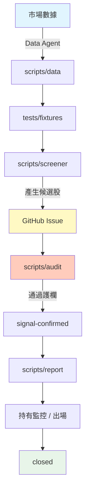

# tw-institutional-strategy

台股機構籌碼策略自動化倉庫。本倉庫以 GitHub Issues 作為候選股追蹤單、GitHub Actions 作為排程與審核引擎、GitHub Projects 作為看板，並以 `tests/fixtures/` 中的標準化測試資料作為各階段的參照基準。

---

## 系統架構圖



---

## 六個 Phase 說明

| Phase | 名稱 | 說明 |
|---|---|---|
| Phase 0 | 資料標準化 | 已產出 `tests/fixtures/oracle_input_*.json` 與 `oracle_output_*.json`，作為後續開發與測試的黃金標準。 |
| Phase 1 | 倉庫基礎建設 | 建立資料夾結構、Issue Templates、Labels、Projects Board 設定與本說明文件。 |
| Phase 2 | 數據管線 | `scripts/data/` 負責每日從 TWSE 等來源取得原始數據，並輸出到 fixtures 格式。 |
| Phase 3 | 篩選器 | `scripts/screener/` 讀取標準化資料，依 Setup A/B/C 條件產生候選股 Issue。 |
| Phase 4 | 審核與護欄 | `scripts/audit/` 在 Issue 建立或標記時執行，檢查必填欄位與策略護欄。 |
| Phase 5 | 報告與追蹤 | `scripts/report/` 產生每日持倉監控、出場提醒與績效結算報告。 |

---

## 資料夾結構

```
scripts/
├── data/          # Data Agent 腳本：取得並標準化市場數據
├── screener/      # Screener 腳本：執行 Setup A/B/C 篩選
├── audit/         # Audit 腳本：護欄檢查與風險標記
└── report/        # Report 腳本：持倉監控與績效報告

.github/
├── workflows/         # GitHub Actions Workflow（待 Phase 2~5 實作）
├── ISSUE_TEMPLATE/    # 三個 Setup 候選股 Issue 表單
└── project-config/    # Projects Board 欄位與自動化規則

tests/
└── fixtures/      # Phase 0 產出的標準化測試資料（請勿更動）
```

---

## Workflow 觸發時機

> 本節描述規劃中的 Workflow 與觸發時機；實際 `.yml` 檔案將在後續 Phase 建立。

| Workflow | 觸發時機 | 用途 |
|---|---|---|
| `data-daily.yml` | 每個交易日收盤後（約 16:30）透過 `schedule` 觸發 | 執行 `scripts/data/` 取得當日數據 |
| `screener-daily.yml` | `data-daily.yml` 成功後 `workflow_run` 觸發 | 執行 `scripts/screener/` 產生候選股 Issue |
| `audit-on-issue.yml` | Issue 建立或新增 `screened` Label 時觸發 | 執行 `scripts/audit/` 檢查欄位與護欄 |
| `report-daily.yml` | 每日盤後透過 `schedule` 觸發 | 產生持倉監控與風險報告 |
| `exit-monitor.yml` | 每日盤後透過 `schedule` 觸發 | 檢查出場條件並標記 `exit-triggered` |
| `manual-human-review.yml` | `workflow_dispatch` 手動觸發 | 對 `human-review` Issue 進行人工覆核 |

---

## 護欄規則清單

Audit Action 會對每個候選股 Issue 執行以下護欄檢查。未通過者將被標記為 `guardrail-blocked`。

1. **必填欄位護欄**：Issue 必須包含該 Setup 模板中的所有必填欄位；缺少任一欄位即拒絕。
2. **風險占比護欄**：`risk_r_pct` 必須 ≤ `1.0`。
3. **Setup B 投信天數護欄**：`trust_10d_buy_days` 必須 ≥ `7`。
4. **Setup C 外資淨值護欄**：`foreign_20d_net` 必須為負值。
5. **Setup C 最近三日護欄**：`foreign_recent_3d` 必須為 `true`。
6. **Setup C 進場日護欄**：`entry_day` 僅允許 `2`、`3`、`4`。
7. **市值門檻護欄**：`market_cap_b` 必須大於策略設定的最低門檻（由 Phase 3 策略腳本定義）。

---

## 如何手動介入

當自動化流程遇到需要人工判斷的情境時，可透過 Label 進行手動介入：

- **`human-review`**：貼上此 Label 後，對應 Issue 會暫停自動狀態轉換，等待人工覆核。覆核完成後由人工移除或改為其他風險標籤。
- **`auto-ok`**：表示該 Issue 已通過自動化護欄檢查，可繼續後續流程。
- **`data-missing`**：表示資料不完整，Audit Action 會留下評論要求補齊欄位或重新觸發數據管線。
- **`guardrail-blocked`**：表示未通過護欄，Issue 會被自動標記並視情況關閉。

**注意**：手動貼上狀態 Label（`screened`、`signal-confirmed`、`holding`、`exit-triggered`）仍會觸發 Projects Board 欄位移動，即使同時貼有 `human-review`。建議先完成人工覆核，再貼上狀態 Label。

---

## 快速開始

1. 確保 `tests/fixtures/` 已存在 Phase 0 資料。
2. 執行 `scripts/setup-labels.sh` 建立所有 Labels。
3. 在 GitHub Projects 中建立 Board，並參考 `.github/project-config/board-columns.md` 設定六個欄位與自動化規則。
4. 後續 Phase 將在 `scripts/` 與 `.github/workflows/` 中補上實際腳本與 Actions。

---

## 授權與貢獻

本倉庫為策略自動化基礎設施，所有業務邏輯與交易策略程式碼請依各自 Phase 獨立開發，避免在基礎建設階段混入策略計算。
