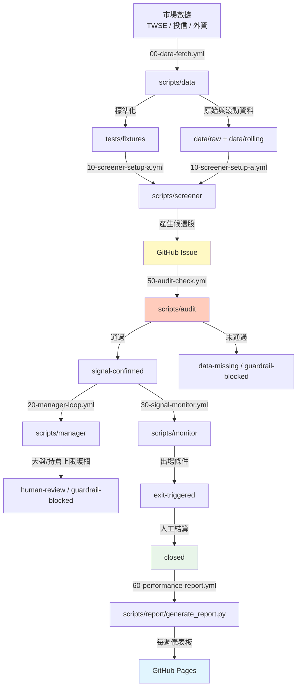

# 系統地圖 System Map

本文檔描述 `tw-institutional-strategy` 的整體架構、資料流、各元件職責，以及它們之間的協作關係。

---

## 1. 整體資料流



### 說明

1. **市場數據** 由 `scripts/data/` 每日取得並標準化；`fetch_institutional.py` 可透過 `--backfill-days` 補抓歷史交易日，`compute_rolling.py` 計算最近 20 日滾動指標並標註實際使用天數。
2. **標準化資料** 進入 `tests/fixtures/` 作為測試黃金標準。
3. **Screener** 讀取資料產生候選股 **GitHub Issue**。
4. **Audit** 檢查 Issue 欄位與護欄規則。
5. **Manager Loop** 監控大盤與持倉上限，必要時標記人工介入或護欄阻擋。
6. **Signal Monitor** 每日檢查 holding Issue 的出場條件。
7. **Report Agent** 每週五彙整所有 Issue 與 Artifact，產生績效儀表板並部署到 **GitHub Pages**。

---

## 2. 元件職責

### Scripts

| 路徑 | 職責 | 輸入 | 輸出 |
|---|---|---|---|
| `scripts/data/fetch_institutional.py` | 從 TWSE 取得機構籌碼資料，支援 `--backfill-days N` 補抓最近交易日 | TWSE API | `data/raw/YYYYMMDD.json` |
| `scripts/data/compute_rolling.py` | 計算最近 20 個交易日滾動指標；原始檔案不足時降級計算，輸出包含 `days_used` | `data/raw/` | `data/rolling/YYYYMMDD_rolling.json` |
| `scripts/screener/setup_a.py` | 執行 Setup A 篩選邏輯；成交量均額由股價 API 取得 | `tests/fixtures/` 或 `data/rolling/` | `data/screener/screener_result_a_YYYYMMDD.json` |
| `scripts/screener/create_issues.py` | 為候選股建立 GitHub Issue | screener result JSON | GitHub Issues |
| `scripts/audit/audit_issue.py` | 驗證 Issue 必填欄位與護欄 | GitHub Issue | Label 變更 + 評論 |
| `scripts/manager/manager_loop.py` | 大盤急跌與持倉上限監控 | TWSE 大盤 API、Issues | `data/manager/manager_report_YYYYMMDD.json`、Label 變更 |
| `scripts/monitor/signal_monitor.py` | 每日檢查 holding Issue 出場條件 | Issues、股價 API | `data/monitor/monitor_report_YYYYMMDD.json`、Label 變更 |
| `scripts/guardrail/pre_run_check.py` | 執行環境與資料前置檢查 | TWSE API、Issues | `data/guardrail/check_result_YYYYMMDD.json` |
| `scripts/report/generate_report.py` | 每週產生績效報告與儀表板 | Issues、Artifacts | `docs/data/report_YYYYWW.json`、`docs/index.html` |

### Workflows

| 檔案 | 觸發 | 職責 |
|---|---|---|
| `00-data-fetch.yml` | `schedule` 每日收盤後 | 還原前次 artifact，首次執行補抓 25 日、之後只抓當日；執行 data scripts；不論 fetch 是否因跳過日期而 exit 1，皆上傳 institutional-data artifact（if: always()） |
| `10-screener-setup-a.yml` | `workflow_run` 於 `00-data-fetch.yml` 完成後 | 當 upstream conclusion 為 success 或 failure 時執行；排除 cancelled。執行 Setup A screener 並建立 Issues |
| `20-manager-loop.yml` | `workflow_run` 於 `00-data-fetch.yml` 完成後 | 當 upstream conclusion 為 success 或 failure 時執行；排除 cancelled。執行 manager loop |
| `30-signal-monitor.yml` | `workflow_run` 於 `20-manager-loop.yml` 成功後 | 執行 signal monitor |
| `50-audit-check.yml` | Issue 建立/Label 變更、`/re-audit` 留言 | 執行 audit |
| `60-performance-report.yml` | `schedule` 每週五 18:30 TW、`workflow_dispatch` | 產生報告並部署到 gh-pages |
| `99-guardrail-check.yml` | `workflow_call` | 被其他 workflow 呼叫，執行前置檢查 |

---

## 3. Issue 生命週期

```
建立 Issue (setup-a/b/c + screened + auto-ok)
        │
        ▼
   Audit 檢查
   ├─ 通過 → signal-confirmed
   └─ 失敗 → data-missing
        │
        ▼
   Manager Loop 檢查
   ├─ 大盤急跌/持倉上限 → human-review / guardrail-blocked
   └─ 正常 → 等待進場
        │
        ▼
   holding（進場後）
        │
        ▼
   Signal Monitor 每日檢查
   ├─ 觸發出場/停損 → exit-triggered (+ result-stoploss-hit)
   └─ 持續持有 → holding
        │
        ▼
   人工結算並關閉 Issue
   ├─ result-profit
   ├─ result-loss
   ├─ result-stoploss-hit
   └─ result-time-exit
```

---

## 4. Artifact 流向

```
00-data-fetch.yml
    ├── (首次) 補抓 25 個交易日
    ├── (非首次) 還原前一次 institutional-data-{run_id} artifact
    └── 產生並上傳 institutional-data-{run_id}
        ├── data/raw/YYYYMMDD.json
        └── data/rolling/YYYYMMDD_rolling.json

10-screener-setup-a.yml
    └── screener-a-{run_id}
        └── data/screener/screener_result_a_YYYYMMDD.json

20-manager-loop.yml
    └── manager-report-{run_id}
        └── data/manager/manager_report_YYYYMMDD.json

30-signal-monitor.yml
    └── monitor-report-{run_id}
        └── data/monitor/monitor_report_YYYYMMDD.json

99-guardrail-check.yml
    └── guardrail-report-{run_id}
        └── data/guardrail/check_result_YYYYMMDD.json

60-performance-report.yml
    └── （無 artifact，直接部署 docs/ 到 gh-pages）
```

---

## 5. 關鍵決策點

| 決策點 | 責任元件 | 結果 |
|---|---|---|
| 是否為交易日 | `scripts/guardrail/pre_run_check.py` | 非交易日則 skip |
| 是否通過篩選 | `scripts/screener/setup_a.py` | 產生候選股 Issue |
| 是否通過 Audit | `scripts/audit/audit_issue.py` | 通過/未通過 |
| 是否觸發大盤護欄 | `scripts/manager/manager_loop.py` | human-review |
| 是否達持倉上限 | `scripts/manager/manager_loop.py` | guardrail-blocked |
| 是否觸發出場/停損 | `scripts/monitor/signal_monitor.py` | exit-triggered、result-stoploss-hit |
| 是否產生本週報告 | `scripts/report/generate_report.py` | 每週五部署 Pages |

---

## 6. 外部依賴

- **TWSE API**：取得市場數據與大盤指數。
- **GitHub Issues / Labels / Projects**：追蹤候選股與持倉狀態。
- **GitHub Actions / Artifacts**：排程執行與資料傳遞。
- **GitHub Pages**：每週績效儀表板託管。
- **`gh` CLI**：腳本與 GitHub 互動的主要介面。

---

## 7. 人機協作邊界

- **全自動**：資料取得、篩選、Audit、大盤/持倉護欄、出場訊號檢查。
- **需人工介入**：
  - 填寫 `position_size_lots`、`risk_r_pct` 等欄位。
  - 決定是否進場（將 `signal-confirmed` 改為 `holding`）。
  - 決定是否出場（關閉 Issue 並貼上 result-* label）。
  - 覆核標記為 `human-review` 的 Issue。
