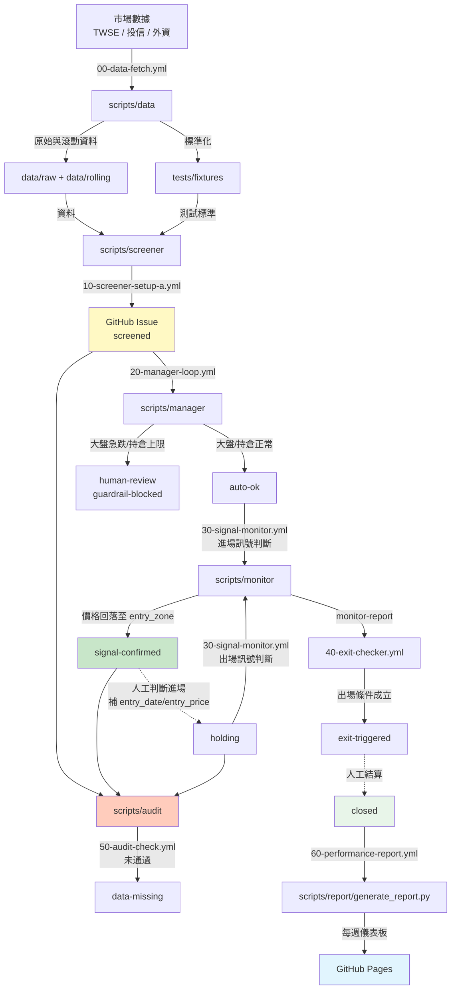

# 系統地圖 System Map

本文檔描述 `tw-institutional-strategy` 的整體架構、資料流、各元件職責，以及它們之間的協作關係。

---

## 0. 版本異動說明

> **本次更新（Setup B/C 規格鎖定修訂版）：**
> 1. 依據目前實際程式碼重新核對後，修正先前規格書中「已實作」的誤述：
>    - `scripts/data/compute_rolling.py` **目前尚未輸出** `foreign_buy_streak_day`，此欄位需要新增。
>    - `scripts/monitor/signal_monitor.py` 的**進場判斷**目前僅實作 Setup A（MA5~MA20），Setup B（突破後量縮不破）與 Setup C（外資連買第 N 天）的進場判斷仍待實作；出場判斷已依 `setup_type` 分流，Setup A/B/C 規則均已存在。
>    - `scripts/manager/manager_loop.py` 對 `screened` Issue 以 label 掃描為主，**沒有日期或 run_id 去重機制**。若 `20-manager-loop.yml` 同時監聽 10/11/12 三個 workflow 的 `completed` 事件，每次觸發都會重新處理當日所有 `screened` Issue；`auto-ok`/`human-review` label 操作本身冪等，但 guardrail 相關評論會重複留言，實作時需補上去重或避開已標記 Issue。
> 2. Issue body 欄位更新：Setup B 新增 `breakout_date`、`breakout_volume_m`；Setup C 的 `foreign_buy_streak_day` 由 `compute_rolling.py` 新增輸出後，screener 寫入 Issue body 作為參考欄位。
> 3. Workflow 觸發鏈維持：在 `00-data-fetch.yml` 完成後並行觸發 `10-screener-setup-a.yml`、`11-screener-setup-b.yml`、`12-screener-setup-c.yml`；三個 screener 產生的 `screened` Issue 由同一個 `20-manager-loop.yml` 統一評估。
>
> ⚠️ **本次 Setup B/C 規格鎖定仍有以下項目待人工確認（後附建議方案）：**
> - `foreign_10d_direction` 判定「明顯大賣」的具體閾值。
>   - **建議**：不由 `compute_rolling.py` 計算，改由 Setup B screener 使用股價/成交量資料計算：`foreign_avg_daily_net / avg_daily_volume_shares`，絕對值超過 `5%` 才判定為 buying / selling，否則 neutral；閾值設為 env var `FOREIGN_10D_DIRECTION_THRESHOLD`，預設 `0.05`。
> - Setup B 量縮條件的成交金額比率閾值，以及「隔天/第三天」的確切天數定義。
>   - **建議**：等待天數為突破日後第 1、2 個交易日（`trading_days_after_breakout ∈ {1, 2}`）；量縮條件為 `volume_today_m ≤ breakout_volume_m × 0.8`，比率設為 env var `SETUP_B_VOLUME_CONTRACTION_RATIO`，預設 `0.8`。
> - Setup C 進場是以 Issue body 的 `entry_day` 單一固定日為準，還是第 2~4 天任一天均可進場。
>   - **建議**：採用窗口制，monitor 在 `2 ≤ foreign_buy_streak_day ≤ 4` 任一天皆可確認進場；`entry_day` 保留為 screener 建議的首選日（資訊欄）。
> - 停損觸發應以 Issue body 的 `stop_loss_price` 為準，還是沿用 `signal_monitor.py` 目前的 `setup_type` 百分比對照表。
>   - **建議**：沿用百分比對照表（a: -7%、b: -6%、c: -5%），並以實際 `entry_price` 計算真實停損價；Issue body 的 `stop_loss_price` 僅作為 screener 階段參考。
> - Setup C 的 `entry_zone` 在 screener 階段應如何預填。
>   - **建議**：screener 預填描述文字「外資連買第 N 天當日價格區間（由 signal monitor 於進場日動態確認）」，monitor 於進場日在留言中補上 `[today_low, today_high]`。
> - `20-manager-loop.yml` 同時監聽 10/11/12 三個 workflow 時，重複觸發導致重複評論的問題應如何解決。
>   - **建議**：在 `manager_loop.py` 中，對已標記 `auto-ok` / `human-review` / `guardrail-blocked` 的 Issue 不再重複留言；或改為 20-manager-loop 只由一個 workflow（例如 10-screener-setup-a）觸發，並在該 workflow 中等待 11/12 完成。兩種方案均需人工決定。
>
> ---

> **本次更新（流程調整）：**
> 1. Workflow 觸發鏈調整為 `00-data-fetch → 10-screener-setup-a → 20-manager-loop → 30-signal-monitor → 40-exit-checker`，使當日新建的 `screened` Issue 能在當日被 Manager Loop 評估，不再延遲一天生效。
> 2. `30-signal-monitor` 新增「進場訊號判斷」職責：掃描 `auto-ok` Issue，判斷今日收盤價是否回落至 `entry_zone`，符合則標記 `signal-confirmed`。原有「掃描 `holding` Issue 計算出場訊號」職責維持不變。
>
> ⚠️ **本次更新採用以下假設，尚待確認，未來若有出入請以實際程式碼與人工決策為準：**
> - `signal-confirmed` 標記時，同步移除 `screened` 與 `auto-ok`（避免同一 Issue 疊加多個狀態 label，也避免 Manager Loop 重複評估已進入下一階段的 Issue）。
> - 進場訊號判斷所需的 `entry_zone`，讀取自 Issue body 中 screener 建立當下寫入的**靜態值**，而非重新計算當下的 MA5/MA20。若需要即時重算，屬於另一個設計方向，需另行確認。
> - Manager Loop 對 `holding` Issue 的每日複核、`guardrail-blocked`/`human-review` 標籤的自動移除機制、總曝險%護欄、`MAX_CANDIDATES_PER_RUN` 數量調整、Setup B/C 對應流程，均**不在本次調整範圍內**，維持原狀。

---

> **本次更新（Setup B/C 規格鎖定）：**
> 1. Workflow 觸發鏈擴充：在 `00-data-fetch.yml` 完成後，並行觸發 `10-screener-setup-a.yml`、`11-screener-setup-b.yml`、`12-screener-setup-c.yml`；三個 screener 產生的 `screened` Issue 皆由同一個 `20-manager-loop.yml` 評估。
> 2. `20-manager-loop.yml` 的 `workflow_run` 觸發條件調整為同時監聽 `10/11/12` 三個 workflow 的 `completed` 事件。
> 3. `scripts/data/compute_rolling.py` 新增 `foreign_buy_streak_day`（Setup C 外資連買天數）欄位；Setup B 的 `foreign_10d_direction` 改由 Setup B screener 計算，不寫入 rolling。
> 4. `scripts/monitor/signal_monitor.py` 的進場判斷擴充 Setup B（突破後量縮不破）與 Setup C（外資連買第 N 天）規則；出場判斷已依 `setup_type` 分流，Setup A/B/C 規則均已存在於程式碼中。
> 5. Issue body 新增 Setup B 的 `breakout_date`、`breakout_volume_m`，以及 Setup C 的 `foreign_buy_streak_day`（參考欄位，由 screener 計算後寫入）。
>
> ⚠️ **本次 Setup B/C 規格鎖定仍有以下項目待人工確認（後附建議方案）：**
> - `foreign_10d_direction` 判定「明顯大賣」的具體閾值。
>   - **建議**：不由 `compute_rolling.py` 計算，改由 Setup B screener 使用股價/成交量資料計算：`foreign_avg_daily_net / avg_daily_volume_shares`，絕對值超過 `5%` 才判定為 buying / selling，否則 neutral；閾值設為 env var `FOREIGN_10D_DIRECTION_THRESHOLD`，預設 `0.05`。
> - Setup B 量縮條件的成交金額比率閾值，以及「隔天/第三天」的確切天數定義。
>   - **建議**：等待天數為突破日後第 1、2 個交易日（`trading_days_after_breakout ∈ {1, 2}`）；量縮條件為 `volume_today_m ≤ breakout_volume_m × 0.8`，比率設為 env var `SETUP_B_VOLUME_CONTRACTION_RATIO`，預設 `0.8`。
> - Setup C 進場是以 Issue body 的 `entry_day` 單一固定日為準，還是第 2~4 天任一天均可進場。
>   - **建議**：採用窗口制，monitor 在 `2 ≤ foreign_buy_streak_day ≤ 4` 任一天皆可確認進場；`entry_day` 保留為 screener 建議的首選日（資訊欄）。
> - 停損觸發應以 Issue body 的 `stop_loss_price` 為準，還是沿用 `signal_monitor.py` 目前的 `setup_type` 百分比對照表。
>   - **建議**：沿用百分比對照表（a: -7%、b: -6%、c: -5%），並以實際 `entry_price` 計算真實停損價；Issue body 的 `stop_loss_price` 僅作為 screener 階段參考。
> - Setup C 的 `entry_zone` 在 screener 階段應如何預填。
>   - **建議**：screener 預填描述文字「外資連買第 N 天當日價格區間（由 signal monitor 於進場日動態確認）」，monitor 於進場日在留言中補上 `[today_low, today_high]`。

## 1. 整體資料流



### 說明

1. **市場數據** 由 `scripts/data/` 每日取得並標準化；`fetch_institutional.py` 可透過 `--backfill-days` 補抓歷史交易日，`compute_rolling.py` 計算最近 20 日滾動指標並標註實際使用天數。
2. **標準化資料** 進入 `tests/fixtures/` 作為測試黃金標準。
3. **Screener** 讀取資料產生候選股 **GitHub Issue**（labels: `setup-a`, `screened`）。
4. **Manager Loop** 監控大盤與持倉上限，將 `screened` Issue 標記為 `auto-ok`（正常）或 `human-review` / `guardrail-blocked`（風險觸發）。
5. **Signal Monitor（進場判斷，新職責）** 對 `auto-ok` Issue 計算進場訊號（價格是否回落至 `entry_zone`），成立則標記 `signal-confirmed`。
6. **Audit** 在 Issue 被標記 `screened` / `signal-confirmed` / `holding` 時檢查欄位完整性與護欄規則。
7. **人工判斷** 是否進場，若進場則手動將 `signal-confirmed` 改為 `holding`，並於評論補上 `entry_date`、`entry_price`、`setup_type`。
8. **Signal Monitor（出場判斷，既有邏輯）** 對 `holding` Issue 每日計算出場條件，產生 monitor report。
9. **Exit Checker** 讀取 monitor report，執行出場 Label 操作。
10. **Report Agent** 每週五彙整所有 Issue 與 Artifact，產生績效儀表板並部署到 **GitHub Pages**。

---

## 2. 元件職責

### Scripts

| 路徑 | 職責 | 輸入 | 輸出 |
|---|---|---|---|
| `scripts/data/fetch_institutional.py` | 從 TWSE 取得機構籌碼資料，支援 `--backfill-days N` 補抓最近交易日 | TWSE API | `data/raw/YYYYMMDD.json` |
| `scripts/data/compute_rolling.py` | 計算最近 20 個交易日滾動指標；原始檔案不足時降級計算，輸出包含 `days_used`。**Setup C 所需的 `foreign_buy_streak_day` 目前尚未輸出，需新增。** | `data/raw/` | `data/rolling/YYYYMMDD_rolling.json` |
| `scripts/screener/setup_a.py` | 執行 Setup A 篩選邏輯；成交量均額由股價 API 取得 | `tests/fixtures/` 或 `data/rolling/` | `data/screener/screener_result_a_YYYYMMDD.json` |
| `scripts/screener/create_issues.py` | 為候選股建立 GitHub Issue | screener result JSON | GitHub Issues |
| `scripts/audit/audit_issue.py` | 驗證 Issue 必填欄位與護欄 | GitHub Issue | Label 變更 + 評論 |
| `scripts/manager/manager_loop.py` | 大盤急跌與持倉上限監控，評估 `screened` Issue。**目前對 screened Issue 無日期/run_id 去重機制。** | TWSE 大盤 API、Issues | `data/manager/manager_report_YYYYMMDD.json`、Label 變更（auto-ok / human-review / guardrail-blocked） |
| `scripts/monitor/signal_monitor.py` | **【新增職責】** 對 `auto-ok` Issue 計算進場訊號（價格是否回落至 `entry_zone`），符合則標記 `signal-confirmed`；**目前僅實作 Setup A 進場判斷，Setup B/C 進場判斷待實作。** **【既有職責】** 對 `holding` Issue 每日計算出場條件（判斷層，Setup A/B/C 已分流），產生 monitor report；對缺少進場資訊的 `holding` Issue 標記 `data-missing` | Issues、股價 API | `data/monitor/monitor_report_YYYYMMDD.json`、Issue 評論、Label 變更（signal-confirmed / data-missing） |
| `scripts/exit-checker/exit_checker.py` | 讀取 monitor report，執行出場 Label 操作（執行層） | `data/monitor/monitor_report_YYYYMMDD.json` | `data/exit-checker/exit_report_YYYYMMDD.json`、Issue Label 變更（exit-triggered / result-stoploss-hit / 移除 holding） |
| `scripts/guardrail/pre_run_check.py` | 執行環境與資料前置檢查 | TWSE API、Issues | `data/guardrail/check_result_YYYYMMDD.json` |
| `scripts/report/generate_report.py` | 每週產生績效報告與儀表板 | Issues、Artifacts | `docs/data/report_YYYYWW.json`、`docs/index.html` |

### Workflows

| 檔案 | 觸發 | 職責 |
|---|---|---|
| `00-data-fetch.yml` | `schedule` 每日收盤後 | 還原前次 artifact，首次執行補抓 25 日、之後只抓當日；執行 data scripts；不論 fetch 是否因跳過日期而 exit 1，皆上傳 institutional-data artifact（if: always()） |
| `10-screener-setup-a.yml` | `workflow_run` 於 `00-data-fetch.yml` 完成後 | 執行 Setup A screener 並建立 Issues（labels: `setup-a`, `screened`） |
| `11-screener-setup-b.yml` | `workflow_run` 於 `00-data-fetch.yml` 完成後 | 執行 Setup B screener 並建立 Issues（labels: `setup-b`, `screened`） |
| `12-screener-setup-c.yml` | `workflow_run` 於 `00-data-fetch.yml` 完成後 | 執行 Setup C screener 並建立 Issues（labels: `setup-c`, `screened`） |
| `20-manager-loop.yml` | `workflow_run` 於 `10-screener-setup-a.yml`、`11-screener-setup-b.yml`、`12-screener-setup-c.yml` 完成後 | 當 upstream conclusion 為 success 或 failure 時執行；排除 cancelled。掃描當日所有 `screened` Issue，評估大盤/持倉風險，標記 `auto-ok` / `human-review` / `guardrail-blocked`。⚠️ 目前對 screened Issue 無去重機制，同時監聽 10/11/12 會導致重複觸發，需補上去重或調整觸發策略。 |
| `30-signal-monitor.yml` | `workflow_run` 於 `20-manager-loop.yml` 完成後 | 掃描 `auto-ok` Issue 計算進場訊號，符合則標記 `signal-confirmed`；掃描 `holding` Issue 計算出場訊號，產生 monitor report |
| `40-exit-checker.yml` | `workflow_run` 於 `30-signal-monitor.yml` 成功後；也支援 `workflow_dispatch` 手動補執行 | 讀取 monitor report，對觸發出場/停損的 holding Issue 操作 Label，並上傳 exit-checker-report artifact |
| `50-audit-check.yml` | Issue 建立/Label 變更、`/re-audit` 留言 | 執行 audit。**注意**：`signal-confirmed` 事件在本次調整後才會被實際觸發（先前無程式碼會標記此 label） |
| `60-performance-report.yml` | `schedule` 每週五 18:30 TW、`workflow_dispatch` | 產生報告並部署到 gh-pages |
| `99-guardrail-check.yml` | `workflow_call` | 被其他 workflow 呼叫，執行前置檢查 |

---

## 3. Issue 生命週期

```
建立 Issue (setup-a/b/c + screened)
        │
        ▼
   Manager Loop 檢查（20-manager-loop，緊接 screener 之後執行）
   ├─ 大盤急跌 → human-review
   ├─ 持倉達上限 → guardrail-blocked
   └─ 正常 → auto-ok
        │
        ▼
   ⚠️ human-review / guardrail-blocked 之後續轉換：
      程式碼未涵蓋（只加不移除，不自動轉入 auto-ok）
        │
        ▼（auto-ok 分支）
   Signal Monitor 進場訊號檢查（30-signal-monitor，新增職責）
   ├─ 價格回落至 entry_zone → signal-confirmed（移除 screened、auto-ok）
   └─ 尚未回落 → 保持 auto-ok，隔日再檢查
        │
        ▼
   Audit 檢查（50-audit-check，於 signal-confirmed 觸發）
   ├─ 通過 → 等待人工進場
   └─ 失敗 → data-missing
        │
        ▼
   ⚠️ 人工判斷是否進場（程式碼未涵蓋此轉換）
        │
        ▼
   holding（人工手動貼上，並補填 entry_date / entry_price / setup_type）
        │
        ▼
   Signal Monitor 出場訊號檢查（30-signal-monitor，既有邏輯不變）
   ├─ 產生 monitor report
   └─ 持續持有 → holding
        │
        ▼
   Exit Checker 讀取 monitor report 並執行 Label 操作
   ├─ 觸發出場/停損 → exit-triggered（+ result-stoploss-hit）並移除 holding
   └─ 無出場 → 保持 holding
        │
        ▼
   人工結算並關閉 Issue
   ├─ result-profit
   ├─ result-loss
   ├─ result-stoploss-hit
   └─ result-time-exit
```

---

## 4. Artifact 流向

```
00-data-fetch.yml
    ├── (首次) 補抓 25 個交易日
    ├── (非首次) 下載前一次 institutional-data-{run_id} named-artifact 到 data/
    └── 產生並上傳 institutional-data-{run_id}
        ├── data/raw/YYYYMMDD.json
        └── data/rolling/YYYYMMDD_rolling.json

10-screener-setup-a.yml（緊接 00-data-fetch 之後）
    └── screener-a-{run_id}
        └── data/screener/screener_result_a_YYYYMMDD.json

11-screener-setup-b.yml（緊接 00-data-fetch 之後）
    └── screener-b-{run_id}
        └── data/screener/screener_result_b_YYYYMMDD.json

12-screener-setup-c.yml（緊接 00-data-fetch 之後）
    └── screener-c-{run_id}
        └── data/screener/screener_result_c_YYYYMMDD.json

20-manager-loop.yml（緊接 10/11/12 任一 screener 之後）
    └── manager-report-{run_id}
        └── data/manager/manager_report_YYYYMMDD.json

30-signal-monitor.yml（緊接 20-manager-loop 之後）
    └── monitor-report-{run_id}
        └── data/monitor/monitor_report_YYYYMMDD.json（含進場訊號與出場訊號兩部分）

40-exit-checker.yml
    └── exit-checker-report-{run_id}
        └── data/exit-checker/exit_report_YYYYMMDD.json

99-guardrail-check.yml
    └── guardrail-report-{run_id}
        └── data/guardrail/check_result_YYYYMMDD.json

60-performance-report.yml
    └── （無 artifact，直接部署 docs/ 到 gh-pages）
```

---

## 5. 關鍵決策點

| 決策點 | 責任元件 | 結果 |
|---|---|---|
| 是否為交易日 | `scripts/guardrail/pre_run_check.py` | 非交易日則 skip |
| 是否通過篩選 | `scripts/screener/setup_a.py` | 產生候選股 Issue |
| 是否觸發大盤護欄 | `scripts/manager/manager_loop.py` | human-review |
| 是否達持倉上限 | `scripts/manager/manager_loop.py` | guardrail-blocked |
| 是否核可進入 Worker Queue | `scripts/manager/manager_loop.py` | auto-ok |
| **是否符合進場訊號（新增）** | **`scripts/monitor/signal_monitor.py`** | **signal-confirmed** |
| 是否通過 Audit | `scripts/audit/audit_issue.py` | 通過/未通過 |
| 是否觸發出場/停損 | `scripts/monitor/signal_monitor.py`（判斷）<br>`scripts/exit-checker/exit_checker.py`（執行 Label） | exit-triggered、result-stoploss-hit |
| 是否產生本週報告 | `scripts/report/generate_report.py` | 每週五部署 Pages |

---

## 6. 外部依賴

- **TWSE API**：取得市場數據與大盤指數。
- **GitHub Issues / Labels / Projects**：追蹤候選股與持倉狀態。
- **GitHub Actions / Artifacts**：排程執行與資料傳遞。
- **GitHub Pages**：每週績效儀表板託管。
- **`gh` CLI**：腳本與 GitHub 互動的主要介面。

---

## 7. 人機協作邊界

- **全自動**：資料取得、篩選、Audit、大盤/持倉護欄、**進場訊號判斷（新增）**、出場訊號檢查。
- **需人工介入**：
  - 填寫 `position_size_lots`、`risk_r_pct` 等欄位。
  - 決定是否進場（將 `signal-confirmed` 改為 `holding`，並補上 `entry_date`/`entry_price`/`setup_type`）。
  - 決定是否出場（關閉 Issue 並貼上 result-* label）。
  - 覆核標記為 `human-review` 的 Issue。
